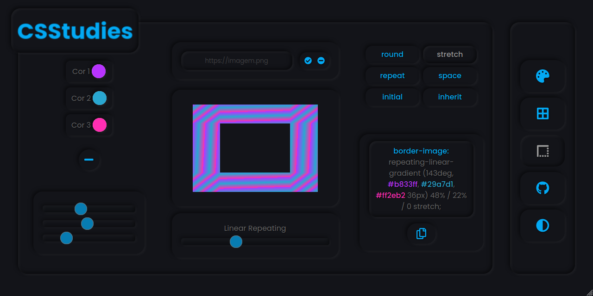

<h1 align="center">

  CSS-Studies

  

</h1>

<h3>

  <ol>
    <li>

[Tecnologias](#tech)
    </li>

  <li>
    
  [Imagens](#assets)
      <ol>
        <li>[Desktop](#desktop)</li>
        <li>[Mobile](#mobile)</li>
        <li>[Modo Escuro](#darkmode)</li>
      </ol>
    </li>
    <li>[Autor](#author)</li>
  </ol>

</h3>

<h3 align="center">

  Aplicação com interface baseada em Neumorphism | Geração de códigos CSS para Gradientes e Bordas | Com visualização instantânea.

  Acesse em: <a href="https://css-studies.vercel.app" target="_blank">https://css-studies.vercel.app</a>

</h3>

<h2 align="center" id="tech">

  Tecnologias
   

  
  
  
  

</h2>

  <h3 id="desktop">Desktop:</h3>

  

   

  

   

  <h3 id="mobile">Mobile:</h3>

  

   

  <h3 id="darkmode">Modo Escuro:</h3>

  

<h4 align="center">

  Esse projeto foi gerado com [Angular CLI](https://github.com/angular/angular-cli) versão 11.2.0.

</h4>

  | [ @pedrorivald](https://github.com/pedrorivald) |
| :---: |

   

  

